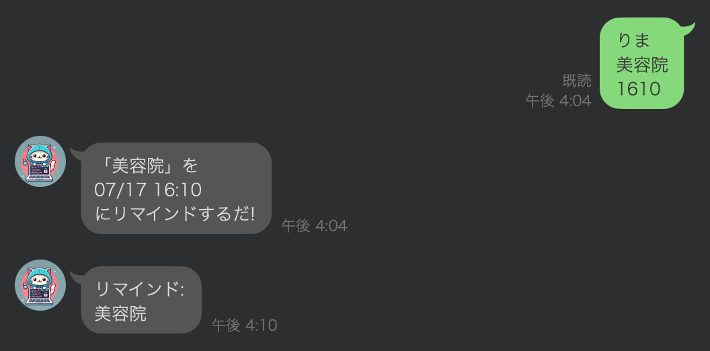
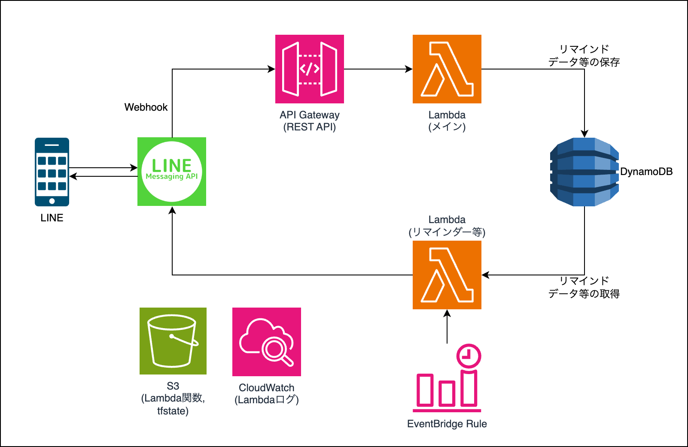

# line-nandemo-infrastructure

## アプリ概要
色んな便利機能を持つLINEボットです。<br>
思いつき次第、機能追加していくつもり。

## 今ある機能
### 簡単リマインダー
以下のような3行のメッセージを送信することで、指定日時にリマインドをセットできます。<br>

- `りま`: リマインド機能を使用するということの指定。<br>
- `美容院`: リマインドするタスク。<br>
- `1610`: 次の16:10にリマインドしてねという指定。8桁で「07151630」のように先頭4桁で月日を指定すれば7/15 16:30にリマインド実行される<br>

## 主な使用技術
- AWS
  - Lambda（Python）
  - API Gateway
  - DynamoDB
  - EventBridge
- LINE Messagging API

## システム構成図


## 技術的こだわりポイント
### LambdaレイヤーのPythonパッケージの動的な準備
Dockerを使用してLambdaレイヤーのPythonパッケージを動的かつ自動的に準備する方法を採用しました。<br>

- パッケージ管理ファイルrequirements.txtの内容をハッシュ化して、変更があればパッケージ準備プロセスをトリガーします。
- Dockerを使ってPython 3.11の環境でパッケージ群をインストールします。これにより、Lambdaランタイムと同じ環境でパッケージがビルドされます。
- Terraformのlocal-execプロビジョナーを使って、Dockerコマンド等を自動で実行します。これにより、パッケージ群のインストールが自動で行われます。

```hcl
locals {
  python_packages_requirements_path = "${path.module}/files/lambda/layers/python_packages/requirements.txt"
  python_packages_output_path       = "${path.module}/outputs/lambda/layers/outputs/python_packages/output.zip"
  python_packages_venv_dir          = "${path.module}/outputs/lambda/venv"
  python_packages_source_dir        = "${path.module}/outputs/lambda/layers/sources/python_packages"
}

resource "null_resource" "prepare_python_packages" {
  triggers = {
    "requirements_diff" = filebase64(local.python_packages_requirements_path)
  }

  provisioner "local-exec" {
    command = <<-EOF
      rm -rf ${local.python_packages_source_dir}/python &&
      mkdir -p ${local.python_packages_source_dir}/python &&
      docker pull python:3.11-slim &&
      docker run --rm -v $(pwd)/${local.python_packages_requirements_path}:/app/requirements.txt \
      -v $(pwd)/${local.python_packages_source_dir}/python:/app/python \
      python:3.11-slim /bin/sh -c "
        pip install -r /app/requirements.txt -t /app/python
      "
    EOF

    on_failure = fail
  }
}

data "archive_file" "python_packages_layer" {
  type        = "zip"
  source_dir  = local.python_packages_source_dir
  output_path = local.python_packages_output_path

  depends_on = [
    null_resource.prepare_python_packages
  ]
}

resource "aws_lambda_layer_version" "python_packages" {
  layer_name          = "${var.env}-${var.project}-python-packages"
  s3_bucket           = aws_s3_bucket.lambda_layers.id
  s3_key              = aws_s3_object.python_packages_layer.key
  source_code_hash    = data.archive_file.python_packages_layer.output_md5
  compatible_runtimes = ["python3.11"]
}

resource "aws_s3_object" "python_packages_layer" {
  bucket = aws_s3_bucket.lambda_layers.id
  key    = "python_packages_layer.zip"
  source = data.archive_file.python_packages_layer.output_path
  etag   = data.archive_file.python_packages_layer.output_md5
}
```
