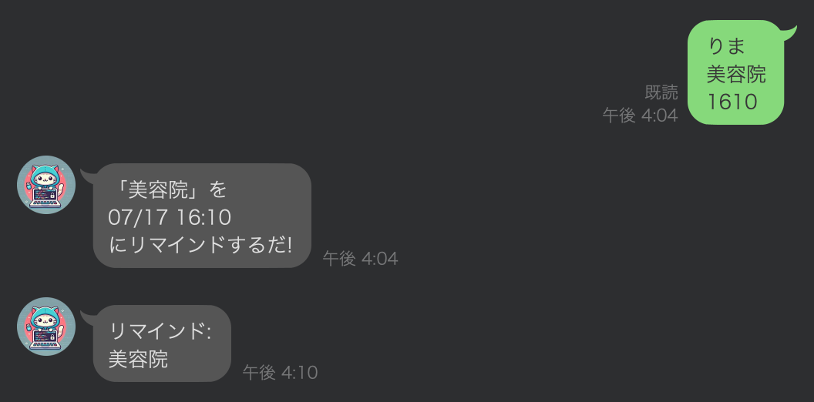
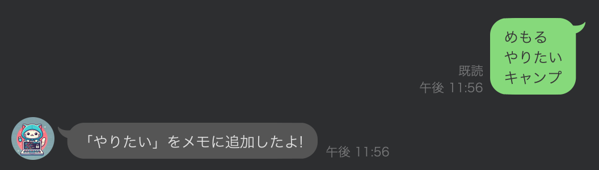
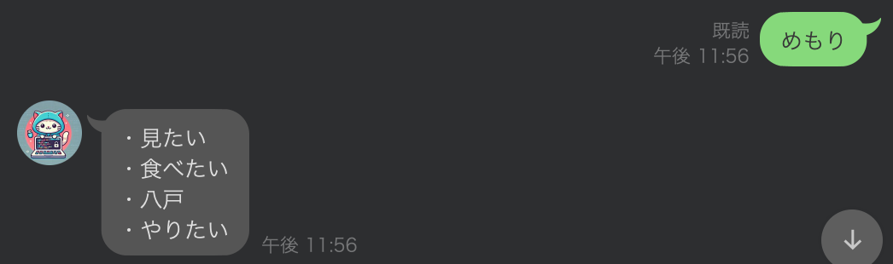
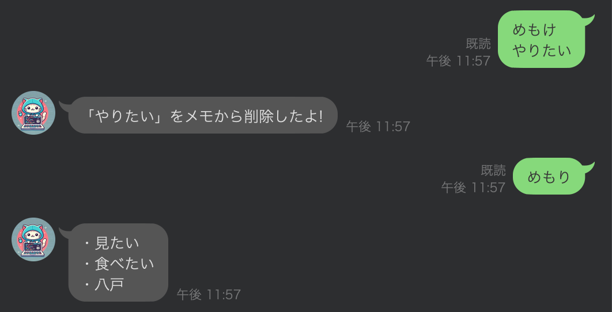
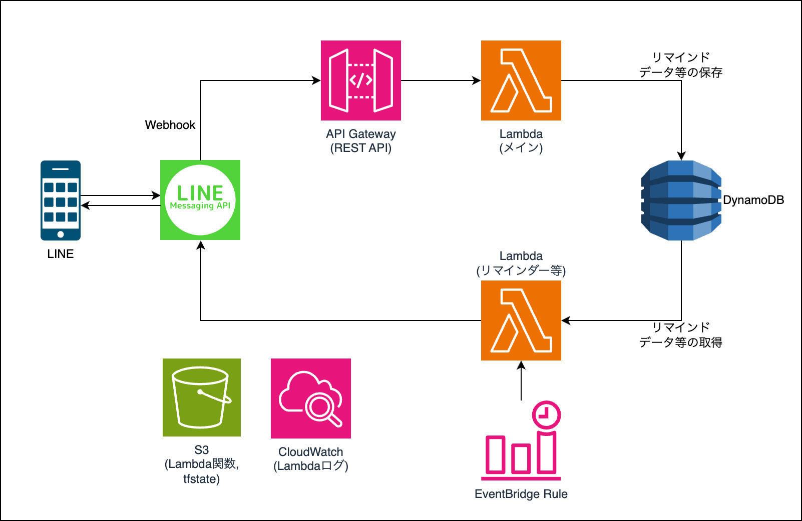

# line-nandemo-infrastructure

## アプリ概要
色んな便利機能を持つLINEボットです。 
思いつき次第、機能追加していくつもり。

## 今ある機能
### 簡単リマインダー
以下のような3行のメッセージを送信することで、指定日時にリマインドをセットできます。 

- `りま`: リマインド機能を使用するということの指定。 
- `美容院`: リマインドするタスク。 
- `1610`: 次の16:10にリマインドしてねという指定。8桁で「07151630」のように先頭4桁で月日を指定すれば7/15 16:30にリマインド実行される 

### 簡単メモ
- メモを追加する

- メモリスト

- メモを見る

- メモを消す

## 主な使用技術
- AWS
  - Lambda（Python）
  - API Gateway
  - DynamoDB
  - EventBridge
- LINE Messagging API

## システム構成図

## 技術的こだわりポイント
### LambdaレイヤーのPythonパッケージの動的な更新
- 課題 
PythonのLambdaレイヤーにライブラリを追加する場合、ローカルPCでPython環境を整えて`pip install`を実行し、それを現在のLambdaレイヤーのソースと差し替えてapplyを打つ流れになる。
  - ローカルPCで当該バージョンのPython環境を用意するのが手間
  - 複数人が携わる場合に環境差異がネック

- 工夫 
本Terraformリポジトリにrequirements.txtを配置。 
`terraform apply`時に以下が実行されるようにした。 
  - external data resourceでprepare_python_packages.shスクリプトを呼び出す。 
  - スクリプト内で、指定バージョンのPythonのDockerイメージをビルドし、requirements.txt記載の依存パッケージをインストールし、そのパスをJSONで返却。
  - archive_fileでそのパスをsource_dirとしてzipファイルを作成。
  - zipファイルをS3にアップロードし、Lambda layerとして登録する。

これにより、requirements.txtを更新してapplyを叩くのみでLambda Layerの更新が可能に。 
ローカル環境差異の問題も解決。
